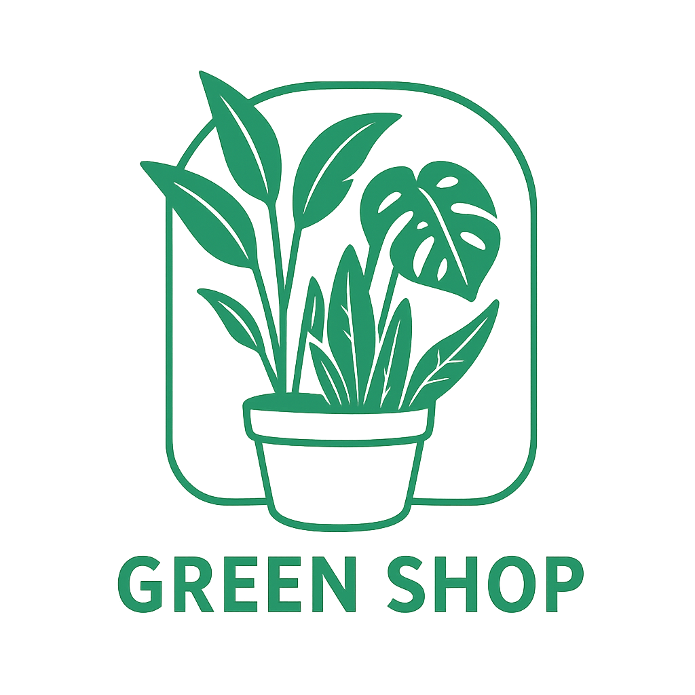
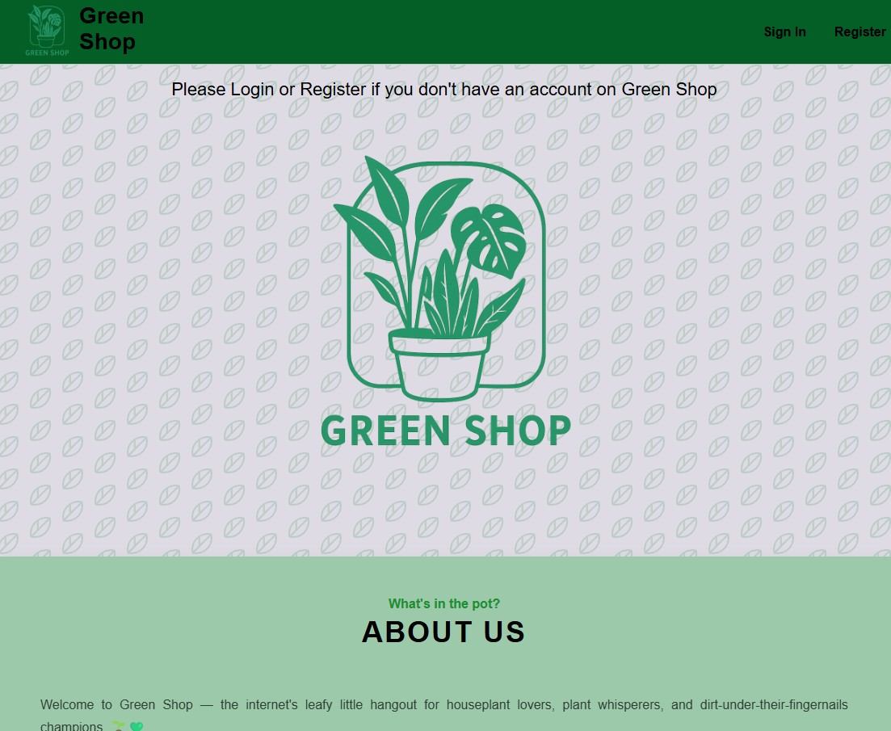
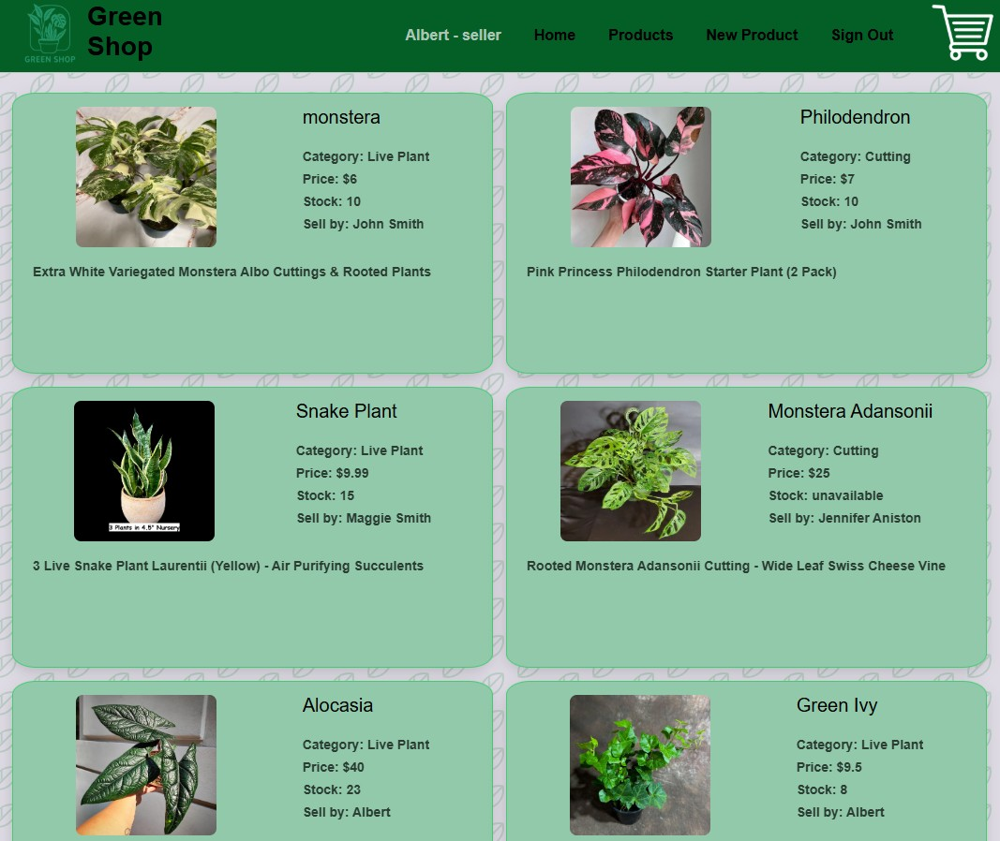
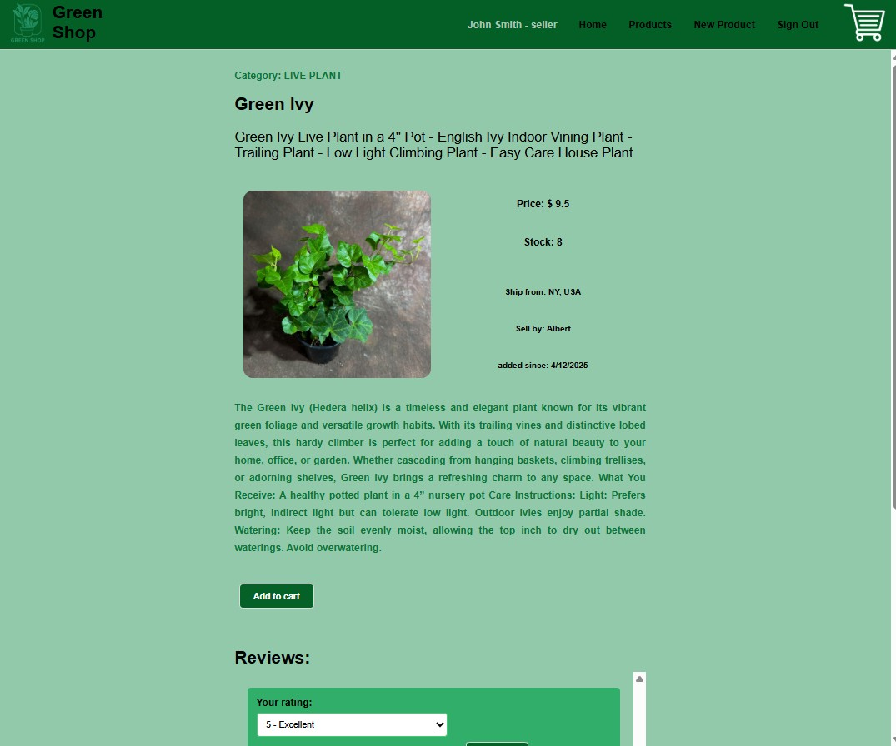
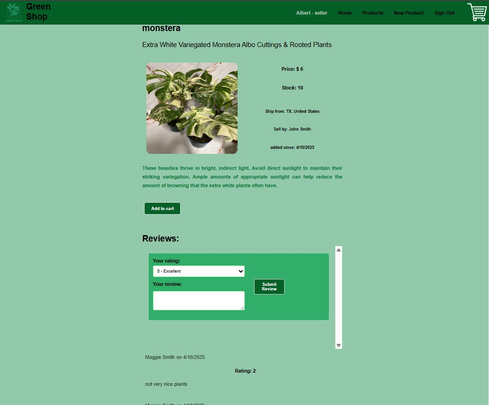
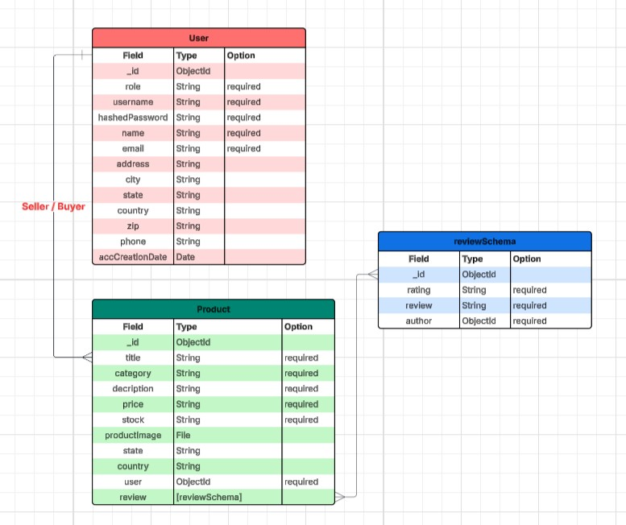

# GREEN SHOP

## Green Shop is a platform to bring together people who love beautiful house plants so they can buy or sell live plants, plant cuttings, seeds, accessories, and more. I personally love plants, especially house plants. I have a lot of plants at home such as monstera, photos, and others. these plants are increasing in number and density, so I have to throw them away. It's a shame, and I know there are a lot of people out there who want to maintain and care for the plants that I threw away. This gave me the idea to create a Green Shop, a place where ordinary people like me can sell and buy plants.

## Here are some pictures of the Green Shop:

### Landing page:

### Product List:

### Product Detail:

### Product Review Section:

## Getting Started:

#### Before creating the Green Shop project, I made a plan using Trello, and also created an ERD with Lucid Chart. Here's an image of the ERD and also the Trello link.

#### ERD

Project planning link: https://trello.com/invite/b/67f372cc3fc5a4d63caa7a0b/ATTI6a345e065a7a3acac6508b29afb55b49ADF268B0/green-shop

#### Green Shop back end is built with Express and Node. The database is built with MongoDB.  The back-end and front-end applications implement JWT token-based authentication to sign up, sign in, and sign out users. The front-end application is built with React. 

#### The Green App is not yet able to perform buying and selling transactions, but only focuses on User Authentication (sign-up/sign-in), Product creation, Product show, product update, and product delete. Also review products from users other than the product owner.

Front-end GitHub repo link: https://github.com/yunus-h/front-end-green-shop.git

Back-end GitHub repo link: https://github.com/yunus-h/back-end-green-shop.git

Deployed project link: https://app.netlify.com/sites/yunusgreenshop

### Attributions:

https://www.etsy.com/
https://css-tricks.com/snippets/css/a-guide-to-flexbox/
https://jwt.io/
https://trello.com/
https://lucid.app/

### Technologies used:
Express, Node, React, JWT, MongoDB, Postman, Dotenv, Bcrypt  

### Next steps: 

Green Shop still has many limitations, if I have enough time, I will develop this app so that it can make payment transactions, calculate the average rating of each product, display products by category.
